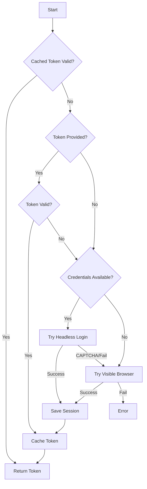

# Discord Authentication Improvements

## Overview

The Discord authentication system has been significantly enhanced to provide a more reliable and automated experience with multiple fallback options.

## Key Features

### 1. **Multi-Source Token Discovery**
The system now attempts to obtain Discord tokens from multiple sources in priority order:

1. **Direct token parameter** - Pass token directly to the `getToken()` method
2. **Token file path** - Specify a file containing the token
3. **Environment variables** - `DISCORD_TOKEN` or `DISCORD_USER_TOKEN`
4. **Home directory file** - `~/.discord-token`
5. **Cached token** - Previously saved valid token
6. **Automated browser login** - Using email/password from environment
7. **Manual browser login** - As last resort

### 2. **Session Persistence**
- Browser sessions (cookies & localStorage) are encrypted and saved
- Sessions are automatically restored on subsequent runs
- Reduces need for repeated logins
- Encryption uses configurable key via `DISCORD_SESSION_KEY` environment variable

### 3. **Automated Login Flow**
- **Headless mode first**: Attempts login without visible browser
- **Human-like behavior**: Random delays between form inputs
- **CAPTCHA detection**: Automatically falls back to visible browser
- **Error handling**: Detects login errors and retries
- **Retry mechanism**: Up to 3 attempts with exponential backoff

### 4. **Token Validation**
- All tokens are validated against Discord API before use
- Expired tokens are automatically refreshed
- Token age limit of 30 days enforced
- Failed validations trigger re-authentication

### 5. **Enhanced Security**
- Session data encrypted with AES-256-CBC
- Proper IV generation for each encryption
- Token storage in secure cache directory
- No plaintext tokens in logs (only first 20 chars shown)

## Usage

### Basic Usage
```typescript
const auth = new DiscordAuth();
const result = await auth.getToken();
console.log(`Authenticated as: ${result.username}`);
```

### With Token File
```typescript
const result = await auth.getToken({
  tokenFile: '/path/to/discord-token.txt'
});
```

### Direct Token
```typescript
const result = await auth.getToken({
  token: 'your-discord-token-here'
});
```

## Environment Variables

### Required for Automated Login
- `DISCORD_EMAIL` - Discord account email
- `DISCORD_PASSWORD` - Discord account password

### Optional
- `DISCORD_TOKEN` or `DISCORD_USER_TOKEN` - Pre-obtained token
- `DISCORD_SESSION_KEY` - Encryption key for session data (recommended to set)

## File Locations

### Cache Directory
Default: `./data/.auth/`

Contains:
- `discord-token.json` - Cached token and metadata
- `discord-session.json` - Encrypted browser session

### Home Directory Token
Location: `~/.discord-token`

Plain text file containing only the Discord token.

## Authentication Flow



## Error Handling

### Common Issues and Solutions

1. **CAPTCHA Required**
   - Automatically switches to visible browser
   - User must complete CAPTCHA manually
   - Session saved for future use

2. **Invalid Credentials**
   - Clear error message provided
   - Suggests checking environment variables
   - Falls back to manual login

3. **Rate Limiting**
   - Built-in retry with exponential backoff
   - Respects Discord's rate limits
   - Graceful degradation

4. **Token Expiration**
   - Automatic detection and refresh
   - Cached tokens older than 30 days rejected
   - Seamless re-authentication

## Best Practices

1. **Set a custom session encryption key**:
   ```bash
   export DISCORD_SESSION_KEY="your-strong-encryption-key"
   ```

2. **Use token file for production**:
   - More secure than environment variables
   - Easy to rotate tokens
   - No accidental exposure in logs

3. **Enable session persistence**:
   - Reduces login frequency
   - Faster startup times
   - Better user experience

4. **Monitor token age**:
   - Tokens expire after ~30 days
   - Implement token rotation
   - Use webhook notifications for expiry

## Testing

### Run Enhanced Authentication Test
```bash
npm run test:discord:auth:enhanced
```

This test will:
1. Clear existing auth cache
2. Test automatic authentication
3. Verify token caching
4. Validate token with Discord API

### Clear Authentication Cache
```bash
# In code
await auth.clearCache();

# Or use the indexer
const indexer = new DiscordUnifiedIndexer(channels, outputDir);
await indexer.clearAuthCache();
```

## Migration Guide

### From Old System
1. Remove `DISCORD_USER_TOKEN` from code, use environment
2. Update to use new `getToken()` method signature
3. Enable session persistence for better performance
4. Set custom encryption key for production

### Environment Setup
```bash
# .env file
DISCORD_EMAIL=your-email@example.com
DISCORD_PASSWORD=your-password
DISCORD_SESSION_KEY=your-encryption-key
# Optional: DISCORD_TOKEN=your-token
```

## Security Considerations

1. **Never commit tokens or credentials**
2. **Use `.gitignore` for auth cache directory**
3. **Rotate tokens regularly**
4. **Use strong encryption keys**
5. **Limit token scope if possible**
6. **Monitor for suspicious activity**

## Future Improvements

1. **OAuth2 Flow** - Implement proper OAuth2 authentication
2. **Token Refresh** - Automatic token refresh before expiry
3. **Multiple Account Support** - Switch between accounts
4. **2FA Support** - Handle two-factor authentication
5. **Token Scope Management** - Request minimal permissions